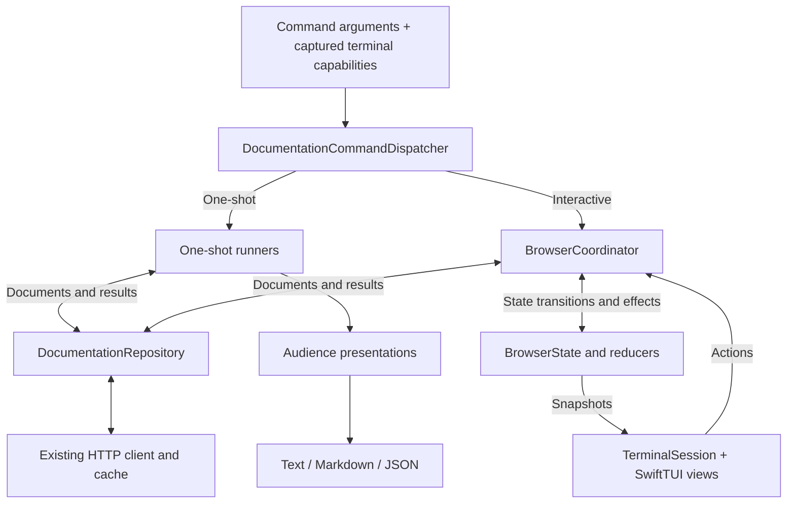

# Documentation browser architecture

The application separates documentation retrieval, semantic content, session behavior, output presentation, and terminal rendering. SwiftTUI is an adapter, not the owner of command parsing, application logging, or telemetry.

## Data flow and ownership

The composition root in `Sources/CLI/main/` resolves one mode before logging bootstrap and passes that same mode into dispatch. It allocates shared session logs only for interactive execution. The browser is constructed lazily on the interactive branch. One-shot execution does not initialize terminal resources.

Commands remain under `Sources/CLI/cmd/`. They provide explicit requests and telemetry context. Existing command runners orchestrate retrieval and rendering and return byte/count information for telemetry. Search text is not added to telemetry context.

## Repository and normalization

`DocumentationRepository` reuses the existing validated client and HTTP transport. It exposes named-type, exact-page, technology-root, symbol-list, detailed-search, and technology-catalog operations. No second HTTP stack or eager symbol crawler is introduced.

`DocumentationPageDecoder` normalizes symbols, collections, and technology pages without requiring symbol-only metadata on non-symbol pages. Pages retain declarations, availability, semantic inline/block content, grouped relationships, topics, and related references. Children come from ordered topic-group identifiers resolved through references, not from flattening the reference dictionary.

`DocumentationDestination` stores technology, exact documentation path, and optional fragment. Named command input retains dotted Swift-name handling. Exact link navigation preserves path punctuation and case. Boundary resolution rejects traversal, credentials, control characters, and unsupported executable schemes. External URLs are never fetched by the documentation transport.

The repository returns response byte counts with normalized pages. Root loading retains canonical identity and already-fetched bytes. The HTTP cache is independent of session state.

## Session state and effects

Browser, navigator, search, history, focus, viewport, and loading/error state are framework-independent values. Reducers return typed effects and do not perform networking or touch SwiftTUI objects. This is a browser-local flow, not a generic application framework or a SwiftTUI requirement.

`BrowserCoordinator` publishes updated state before executing effects. It owns asynchronous repository work and dispatches completions back on the main actor. Monotonic request identities reject late, cancelled, superseded, or incorrectly scoped responses. Startup is idempotent. Stopping cancels owned work and prevents further actions.

Successful pages are reused by canonical destination within a session. Fetch identity excludes fragments, while navigation preserves them. Shared in-flight requests track consumers, so cancelling a page navigation does not cancel work still needed by an expanded branch. The underlying request is cancelled when its last consumer leaves or the session ends.

History commits only after a successful load. Failure and cancellation preserve the displayed page and forward history. Snapshots retain viewport, selected semantic link, navigator state, and main-pane focus.

Navigator identities describe occurrences in a graph, not just URLs. Duplicate references remain distinct, and cycle detection follows ancestors rather than globally hiding repeated pages. Loaded children survive collapse. A late expansion completion may populate the cache without reopening a branch or moving selection. Technology-specific trees and search state remain available while navigating history.

Search runs on submission, never on each edit. It preserves per-technology query/results/selection and reports partial coverage. It traverses collection groups, not individual symbol pages.

## Shared presentations

Audience presenters transform normalized documents and discovery results into human or agent representations. Text and JSON derive from those presentations. Agent navigation is generated only for CLI-representable destinations with properly quoted arguments.

The terminal document view consumes semantic blocks and links directly. Link identity is never recovered from rendered text or assumed unique by label. Stable occurrence identities are paired with public renderer focus-region geometry to support duplicate labels, wrapped links, and resized viewports. SwiftTUI provides cell measurement rather than application-owned character padding for terminal geometry.

See [Output modes and JSON](OUTPUT.md) for the public contract.

## Terminal adapter

The dependency is pinned to SwiftTUI **0.13.5**, using only the public `SwiftTUIRuntime` product and its embedded `RunLoop`. The application does not use the convenience launcher, `TerminalRunner`, private APIs, or SPI. The runtime remains replaceable without changing the repository, one-shot renderers, or navigation rules.

`BrowserView` composes navigator, document, search, and log components from immutable state plus an action sink. Views have no repository access. `TerminalKeyMapper` translates framework key events into browser actions. Widget handles, focus bindings, layout, and drawing remain in `Sources/CLI/terminal/`.

`TerminalSession` bridges coordinator snapshots and coalesced log updates into `StateContainer`. It injects public presentation/input/signal collaborators and forwards `RuntimeIssueSink` events to the host logger. Runtime exit always detaches callbacks and stops owned work, regardless of whether cancellation throws or returns an ordinary exit result.

Production composition supplies the terminal host and input reader. Startup capability negotiation happens before the event pump begins reading input. The browser renders text, not terminal graphics. Adding late capability probes or graphics requires revalidating input ownership because the upstream convenience path's input-suspension gate is not public.

`TerminalSignals` owns only SIGWINCH, SIGINT, and SIGTERM through Dispatch sources and restores their previous handlers. It does not replace fatal-signal handling such as Sentry's SIGSEGV/SIGABRT hooks. Cleanup covers normal exit, handled interruption, and handled errors, not uncatchable process termination.

External opening accepts validated HTTP(S) URLs and passes one URL argument to `/usr/bin/open` on macOS or `xdg-open` resolved from PATH on Linux. It does not construct shell commands. Tests inject the launcher rather than opening a real browser.

## Logging and project boundaries

The entry point is the sole logging bootstrap owner. Interactive capture replaces console logging while preserving the existing telemetry handler and levels. Bounded session storage and coalesced redraw notifications keep hidden logs useful without a feedback loop. See [Telemetry](TELEMETRY.md).

Replaceable boundaries follow DEBUG injectable protocols and release concrete aliases. Gated collaborator constraints are used where appropriate, without adding protocols to every value or helper. Bundled agent skills remain compiled into the executable, not resource bundles.

There is no persisted browsing history, remembered technology, runtime plugin system, general-purpose reducer framework, framework fork, or custom terminal engine. Platform prerequisites and pending distribution work are documented in [Development](DEVELOPMENT.md). Acceptance criteria are in [Testing](TESTING.md).
